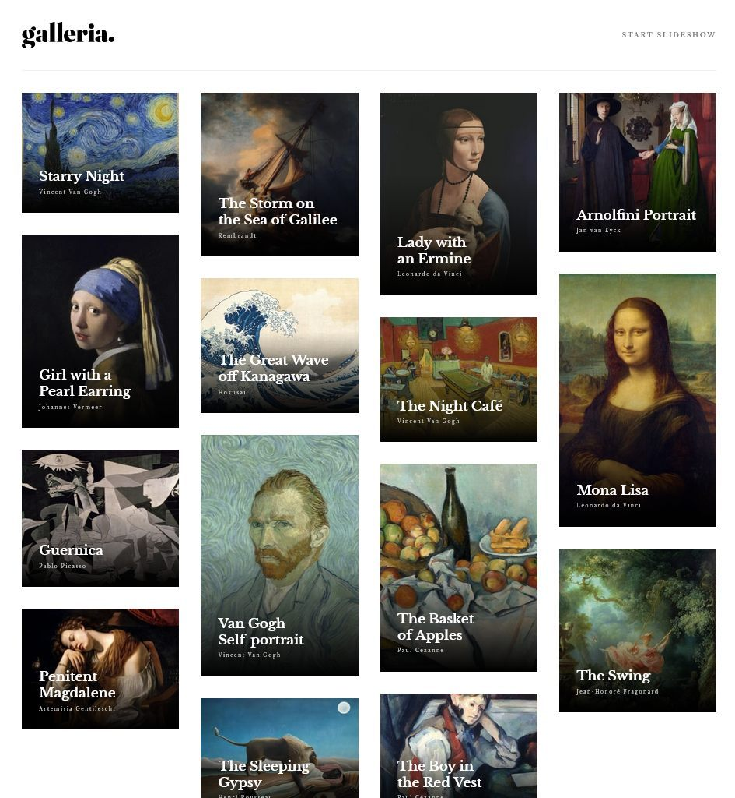
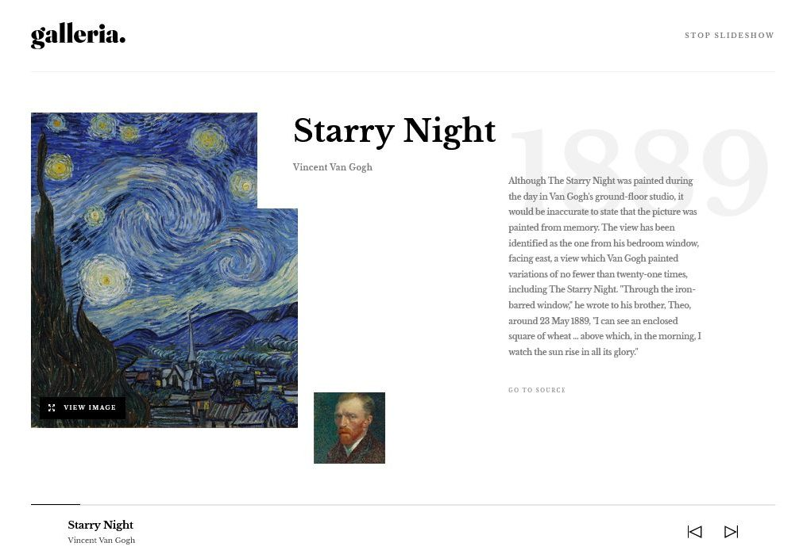

# Frontend Mentor - Galleria slideshow site solution

This is a solution to the [Galleria slideshow site challenge on Frontend Mentor](https://www.frontendmentor.io/challenges/galleria-slideshow-site-tEA4pwsa6). Frontend Mentor challenges help you improve your coding skills by building realistic projects.

## Table of contents

- [Overview](#overview)
  - [The challenge](#the-challenge)
  - [Screenshot](#screenshot)
  - [Links](#links)
- [My process](#my-process)
  - [Built with](#built-with)
  - [What I learned](#what-i-learned)
  - [Continued development](#continued-development)
- [Author](#author)

## Overview

### The challenge

Users should be able to:

- View the optimal layout for the app depending on their device's screen size
- See hover states for all interactive elements on the page
- Navigate the slideshow and view each painting in a lightbox

### Screenshots

### Links

- Solution URL: [https://github.com/2emeagauche/frontend-mentor-galleria-slideshow](https://github.com/2emeagauche/frontend-mentor-galleria-slideshow)
- Live Site URL: [https://2emeagauche.github.io/frontend-mentor-galleria-slideshow/](https://2emeagauche.github.io/frontend-mentor-galleria-slideshow/)

## My process

### Built with

- Semantic HTML5 markup
- SASS
- Flexbox
- CSS Grid
- Mobile-first workflow
- [React](https://reactjs.org/) - JS library
- [Next.js](https://nextjs.org/) - React framework
- [Embla carousel](https://www.embla-carousel.com/) - For slideshow

### What I learned

Using React Context
Creating new git branch then merging
Using Vite config and .env variables for the Base url
Deploying on Github with Action

### Continued development

Go deeper with react optimization.

## Author

- Github - [@2emeagauche](https://github.com/2emeagauche)
- Frontend Mentor - [@2emeagauche](https://www.frontendmentor.io/profile/2emeagauche)